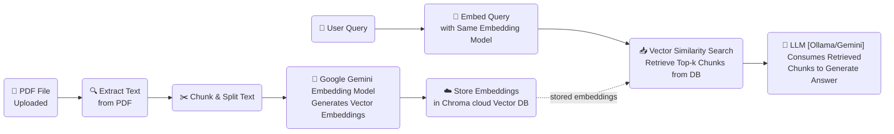
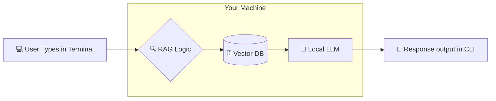
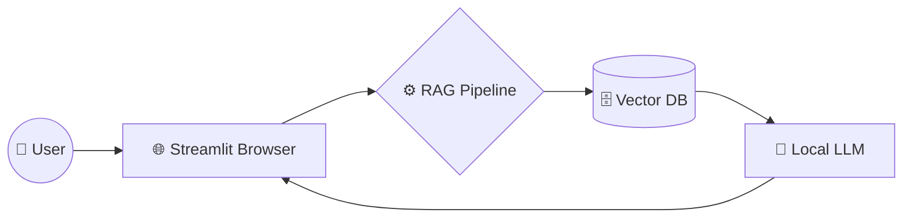
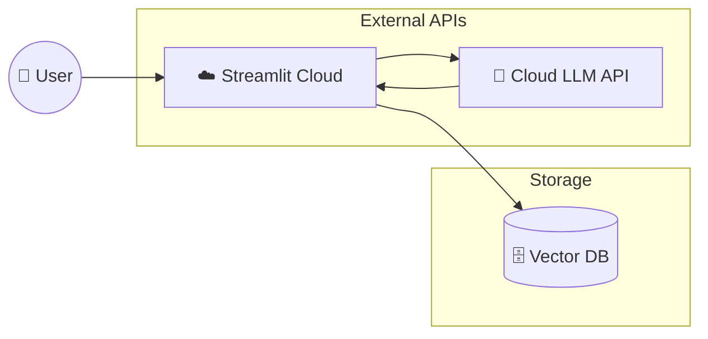

# 🧘‍♀️ Pilat.ai - The Pilates Training Assistant

A RAG-powered AI coach built specifically for beginners learning the STOTT Pilates method — designed to help me understand foundational movements, avoid common mistakes, and build confidence without overwhelming myself with advanced cues.

## 💡Why I Built This
As a complete beginner, I struggled to:

* Remember which muscles to engage in each exercise
* Interpret instructor cues like “lengthen your spine” or “activate your powerhouse”
* Know which modifications were safe for my body type
* Track progress without a trainer
* This assistant became my personalized, always-available STOTT Pilates guide — grounded in official method principles, not generic advice.

## 🎯 How It Helps Beginners
✅ Explains why each movement matters (anatomy + biomechanics)
✅ Breaks down cues into beginner-friendly language
✅ Suggests safe modifications based on your level
✅ Remembers your past questions to give consistent, evolving guidance
✅ Grounds answers in STOTT-specific materials — no hallucinated “Pilates tips”

## 🌟 Key Features
* **Dual-Inference Engine:** Support for **Ollama** (Local) and OpenAI-compatible cloud providers.
* **Cloud-Native Embeddings:** Leverages **Google Gemini** for high-dimensional text vectorization.
* **Persistent Vector Store:** Integrated with **Chroma Cloud** for a scalable, always-on knowledge base.
* **Streamlit UI:** A polished, real-time chat interface with custom persona icons and streaming responses.

## 🏗️ How it Works

### 1. The Data Pipeline (`/src`)
Before the app runs, this script processes your raw documents:
* **Chunking:** Recursively splits PDFs/Docs into manageable segments.
* **Embedding:** Sends chunks to the **Google Gemini API** (`embedding-001`) to generate vectors.
* **Storage:** Pushes those vectors into a **Chroma Cloud Collection**, ensuring the "memory" of the app is accessible from anywhere without local storage overhead.

### 2. The Application Layer 

RAG Architecture Overview



* **Retrieval:** Queries the Chroma Cloud collection to find relevant context.
* **Augmentation:** Injects retrieved context into a system prompt.
* **Generation:** Streams the final answer using a model via **Ollama/Google Gemini**.

### 3. Deployment Modes

i. Local LLM + CLI



ii. Local Chatbot (Streamlit UI)



iii. Cloud Version (Streamlit Cloud + Cloud LLM)



## 🧰 Tech Stack
- LLM: Google Gemini and Llama3.2
- Vector store: Chroma
- Framework: LangChain, Streamlit
- Language: Python

## 🚀 Setup & Installation

### 1. Prerequisites
* **Python 3.10+**
* **Ollama:** [Download here](https://ollama.com/) to run models locally.
    * Once installed, open your terminal and run: `ollama pull llama3.2` (or your preferred model).
* **API Keys:**
    * **Google AI Studio:** Required for Gemini Embeddings and LLM.
    * **Chroma Cloud:** API Key and Tenant ID for the hosted vector database.

### 2. Installation

#### Clone the repository
```
git clone https://github.com/nonDuck3/pilat_ai_assistant.git
cd pilat_ai_assistant
```

#### Install dependencies
```
pip install -r requirements.txt
```

### 3. Configuration
Create a `.env` file in the root directory:

#### Cloud Credentials
```
GEMINI_API_KEY=<your_gemini_api_key>
CHROMADB_API_KEY=<your_chroma_cloud_key>
TENANT=<your_tenant_id_from_chroma>
DATABASE_NAME=<chroma_database_name>
GOOGLE_URL=<google_gemini_base_url>
```

#### LLM local Configuration (Ollama)
```
OLLAMA_URL=http://localhost:11434/api/chat
```

### 4. Running the Project
* **Step 1: Place your PDFs/documents in the `data/` folder and run `cli_chat.py` to chunk and split the text within your document, generates Gemini embeddings, syncs with Chroma Cloud, and retrieves context:**
    * **```python cli_chat.py --pdf_file "/pilates.pdf" --collection_name "chroma_collection" --query_string "What is Pilates in 5 words?" --prompt_file "system_prompt.md"```**

* **Step 2: Start the UI. Launch the Streamlit dashboard and run:**
    * **Local LLM: ```streamlit run app_local.py```**
    * **Cloud LLM: ```streamlit run app_cloud.py```**